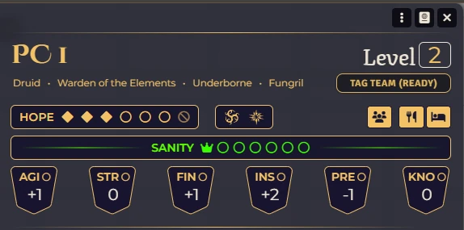
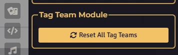

# Daggerheart: Tag Team

Add a button to the character sheet to track tag team use.

<p align="center">
  
</p>

# Features

*   **Tag Team Integration:** Adds a button to the character sheet to easily trigger the Tag Team move.
*   **Resource Management:** Validates if the character has the required 3 Hope.

# How To 

You can reset all with the Menu Button.

<p align="center">
  
</p>

You can also use a macro.

```js
TagTeam.Reset();
```

The GM can click the character sheet to reactivate it.

# Manual Installation

1. Copy this link:

```
 https://raw.githubusercontent.com/brunocalado/dh-tagteam/main/module.json

```
 
2. Open Foundry VTT.
3. Go to the **"Add-on Modules"** tab and click **"Install Module"**.
4. Paste the link into the **"Manifest URL"** box and click Install.

# License

* **Code License:** GNU GPLv3.

* **SFX:** This module uses the sound effects from Pixabay. The audio is provided under the Pixabay Content License, which grants a non-exclusive, worldwide, and royalty-free right to use, modify, and distribute the content for digital and commercial purposes. No attribution is legally required under these terms, but it is provided here for transparency and compliance. [fear](https://pixabay.com/pt/sound-effects/horror-quot-panic-fear-quot-sound-effect-479998/) and [pipchange](https://pixabay.com/pt/sound-effects/tecnologia-new-notification-032-480570/])

**Disclaimer:** This module is an independent creation and is not affiliated with Darrington Press.

# 🧰 My Daggerheart Modules

| Module | Description |
| :--- | :--- |
| 💀 [**Adversary Manager**](https://github.com/brunocalado/daggerheart-advmanager) | Scale adversaries instantly and build balanced encounters in Foundry VTT. |
| 💥 [**Critical**](https://github.com/brunocalado/daggerheart-critical) | Animated Critical. |
| 💠 [**Custom Stat Tracker**](https://github.com/brunocalado/dh-new-stat-tracker) | Add custom trackers to actors. |
| ☠️ [**Death Moves**](https://github.com/brunocalado/daggerheart-death-moves) | Enhances the Death Move moment with immersive audio and visual effects. |
| 📏 [**Distances**](https://github.com/brunocalado/daggerheart-distances) | Visualizes combat ranges with customizable rings and hover calculations. |
| 🤖 [**Fear Macros**](https://github.com/brunocalado/daggerheart-fear-macros) | Automatically executes macros when the Fear resource is changed. |
| 😱 [**Fear Tracker**](https://github.com/brunocalado/daggerheart-fear-tracker) | Adds an animated slider bar with configurable fear tokens to the UI. |
| 🎲 [**Stats**](https://github.com/brunocalado/daggerheart-stats) | Tracks dice rolls from GM and Players. |
| 🧠 [**Stats Toolbox**](https://github.com/brunocalado/dh-statblock-importer) | Import using a statblock. |
| 🛒 [**Store**](https://github.com/brunocalado/daggerheart-store) | A dynamic, interactive, and fully configurable store for Foundry VTT. |
| 📦 [**Extra Content**](https://github.com/brunocalado/daggerheart-extra-content) | Homebrew for Daggerheart. |
| ⚡ [**Quick Actions**](https://github.com/brunocalado/daggerheart-quickactions) | Quick access to common mechanics like Falling Damage, Downtime, etc. |
| 📜 [**Quick Rules**](https://github.com/brunocalado/daggerheart-quickrules) | Fast and accessible reference guide for the core rules. |

# 🗺️ Adventures

| Adventure | Description |
| :--- | :--- |
| ✨ [**I Wish**](https://github.com/brunocalado/i-wish-daggerheart-adventure) | A wealthy merchant is cursed; one final expedition may be the only hope. |
| 💣 [**Suicide Squad**](https://github.com/brunocalado/suicide-squad-daggerheart-adventure) | Criminals forced to serve a ruthless master in a land on the brink of war. |