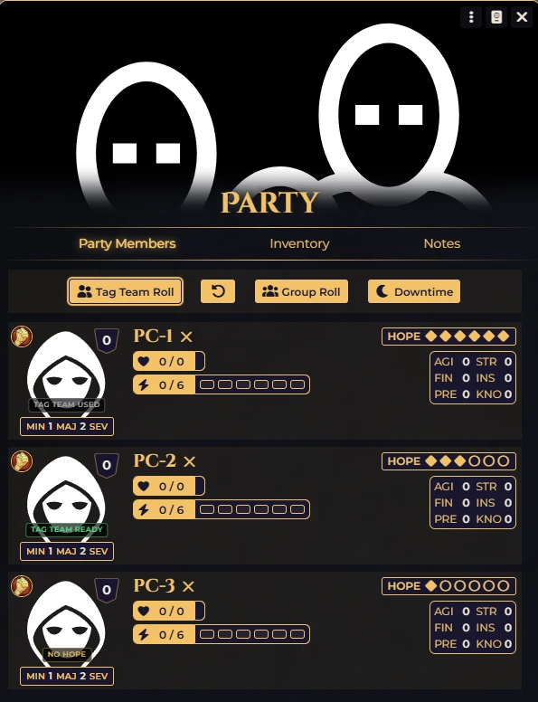

# Daggerheart: Tag Team

Add a button to the character sheet to track tag team use.

<p align="center">
  
</p>

[](https://buymeacoffee.com/mestredigital)

# Features

*   **Tag Team Integration:** Adds a button to the character sheet to easily trigger the Tag Team move.
*   **Resource Management:** Validates if the character has the required 3 Hope.
*   **GM Automation:** When a player activates Tag Team, the GM's party sheet opens automatically on the Party Members tab and the Tag Team Roll dialog launches with the activating character pre-selected as the initiator. Multiple activations accumulate: each additional player who activates Tag Team is added to the pre-selection alongside the previous ones.
*   **Party Sheet Status:** Each character in the party sheet displays a tag team status badge above the damage thresholds — Ready, Used, or No Hope — so the GM can see everyone's state at a glance.
*   **Quick Reset:** A reset button (↺) sits directly beside the Tag Team Roll button in the party sheet, giving the GM an instant reset without opening the Daggerheart Menu.

# How To 

You can reset all with the reset button (↺) in the party sheet, next to the Tag Team Roll button.

<p align="center">
  
</p>

You can also reset from the Menu Button.

<p align="center">
  
</p>

Or use a macro.

```js
TagTeam.Reset();
```

The GM can click the character sheet to reset a single character.

# Manual Installation

1. Copy this link:

```
 https://raw.githubusercontent.com/brunocalado/dh-tagteam/main/module.json

```
 
2. Open Foundry VTT.
3. Go to the **"Add-on Modules"** tab and click **"Install Module"**.
4. Paste the link into the **"Manifest URL"** box and click Install.

# License

* **Code License:** GNU GPLv3.

* **SFX:** This module uses the sound effects from Pixabay. The audio is provided under the Pixabay Content License, which grants a non-exclusive, worldwide, and royalty-free right to use, modify, and distribute the content for digital and commercial purposes. No attribution is legally required under these terms, but it is provided here for transparency and compliance. [fear](https://pixabay.com/pt/sound-effects/horror-quot-panic-fear-quot-sound-effect-479998/) and [pipchange](https://pixabay.com/pt/sound-effects/tecnologia-new-notification-032-480570/])

**Disclaimer:** This module is an independent creation and is not affiliated with Darrington Press.

# 🧰 My Daggerheart Modules

| Module | Description |
| :--- | :--- |
| 💀 [**Adversary Manager**](https://github.com/brunocalado/daggerheart-advmanager) | Scale adversaries instantly and build balanced encounters in Foundry VTT. |
| 🌟 [**Best Modules**](https://github.com/brunocalado/dh-best-modules) | A curated collection of essential modules to enhance the Daggerheart experience. |
| 🐉 [**Colossus**](https://github.com/brunocalado/dh-colossus) | Manage massive multi-part boss encounters with independent HP per part and a single shared stress pool. |
| 💥 [**Critical**](https://github.com/brunocalado/daggerheart-critical) | Animated Critical. |
| 💠 [**Custom Stat Tracker**](https://github.com/brunocalado/dh-new-stat-tracker) | Add custom trackers to actors. |
| ☠️ [**Death Moves**](https://github.com/brunocalado/daggerheart-death-moves) | Enhances the Death Move moment with a dramatic interface and full automation. |
| 📏 [**Distances**](https://github.com/brunocalado/daggerheart-distances) | Visualizes combat ranges with customizable rings and hover calculations. |
| 📦 [**Extra Content**](https://github.com/brunocalado/daggerheart-extra-content) | Homebrew for Daggerheart. |
| 🤖 [**Resource Macros**](https://github.com/brunocalado/daggerheart-fear-macros) | Automatically executes macros when the Fear or Hope resources are changed. |
| 😱 [**Fear Tracker**](https://github.com/brunocalado/daggerheart-fear-tracker) | Adds an animated slider bar with configurable fear tokens to the UI. |
| 🧟 [**Horde**](https://github.com/brunocalado/dh-horde) | Explode single horde tokens into dozens of individual tokens and manage their movement and stats automatically. |
| 🎁 [**Mystery Box**](https://github.com/brunocalado/dh-mystery-box) | Introduces mystery box mechanics for random loot and surprises. |
| ⚡ [**Quick Actions**](https://github.com/brunocalado/daggerheart-quickactions) | Quick access to common mechanics like Falling Damage, Downtime, etc. |
| 📜 [**Quick Rules**](https://github.com/brunocalado/daggerheart-quickrules) | Fast and accessible reference guide for the core rules. |
| 🎲 [**Stats**](https://github.com/brunocalado/daggerheart-stats) | Tracks dice rolls from GM and Players. |
| 🧠 [**Stats Toolbox**](https://github.com/brunocalado/dh-statblock-importer) | Import using a statblock. |
| 🛒 [**Store**](https://github.com/brunocalado/daggerheart-store) | A dynamic, interactive, and fully configurable store for Foundry VTT. |
| 🔍 [**Unidentified**](https://github.com/brunocalado/dh-unidentified) | Obfuscates item names and descriptions until they are identified by the players. |

# 🗺️ Adventures

| Adventure | Description |
| :--- | :--- |
| ✨ [**I Wish**](https://github.com/brunocalado/i-wish-daggerheart-adventure) | A wealthy merchant is cursed; one final expedition may be the only hope. |
| 💣 [**Suicide Squad**](https://github.com/brunocalado/suicide-squad-daggerheart-adventure) | Criminals forced to serve a ruthless master in a land on the brink of war. |